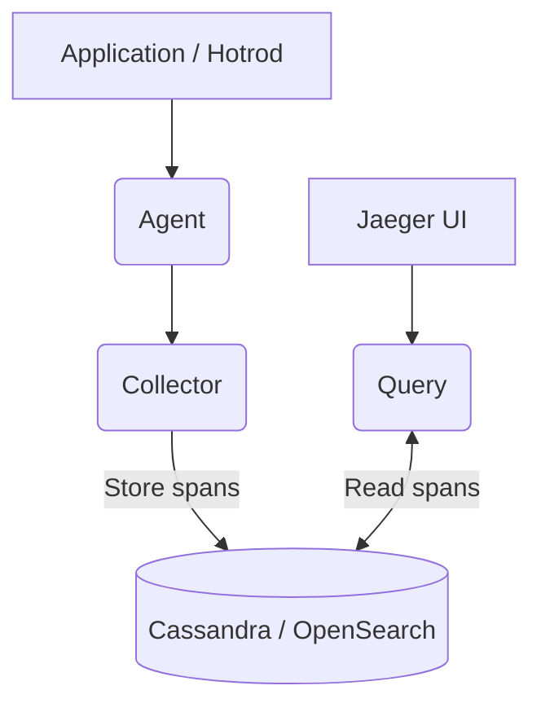

# Qubership Jaeger

[](https://github.com/Netcracker/qubership-jaeger/actions/workflows/build.yml) [](https://netcracker.github.io/qubership-jaeger/) [](https://github.com/Netcracker/qubership-jaeger/releases)

Helm charts that deploy a production-ready [Jaeger](https://www.jaegertracing.io/) stack on Kubernetes/OpenShift, curated by the Qubership team.

## Features / key capabilities

* One-click install of the full Jaeger stack (agent, collector, query, UI)
* Pluggable storage backends: Cassandra (default) or OpenSearch
* TLS everywhere – built-in issuers & secrets for mTLS between components
* Optional Envoy proxy with Basic or OAuth2 auth in front of the Query UI
* Grafana dashboards, Prometheus `PodMonitor`, readiness probes
* Robot-Framework integration tests & Hotrod demo application

## Requirements

* Kubernetes ≥ 1.23 or OpenShift ≥ 4.10
* Helm ≥ 3.8
* For production: a Cassandra or OpenSearch cluster reachable from the namespace

## Installation / Quick start

```bash
# Add the public repo hosted on GitHub Pages
helm repo add qubership-jaeger https://netcracker.github.io/qubership-jaeger
helm repo update

# Install with the default values
helm install jaeger qubership-jaeger/qubership-jaeger \
  --namespace jaeger --create-namespace
```

Use `--version <chart_version>` to pin a specific release.

## Usage

* Access the Jaeger UI (port-forward or via the provided `ingress`):

  ```bash
  kubectl port-forward svc/jaeger-query 16686 -n jaeger
  open http://localhost:16686
  ```

* Send spans in Zipkin format to `jaeger-collector:9411` or native gRPC/HTTP to `jaeger-collector` service.
* Hotrod demo can be enabled via `hotrod.install=true`.

## Configuration

Extensive configuration options are documented in the [Configuration section of the docs](https://netcracker.github.io/qubership-jaeger/examples/). Override any parameter from [`values.yaml`](charts/qubership-jaeger/values.yaml) via `--set` or a custom `values.yaml`.

Examples:

```bash
# Enable OpenSearch storage
helm upgrade --install jaeger qubership-jaeger/qubership-jaeger \
  -n jaeger -f - <<EOF
jaeger:
  storage:
    type: opensearch
EOF
```

## API Reference / Documentation

The full documentation is published at <https://netcracker.github.io/qubership-jaeger/> and mirrors the Markdown files under [`/docs`](https://github.com/Netcracker/qubership-jaeger/tree/main/docs).

## Architecture / Diagram

### System overview



## Testing

Integration and smoke tests can be run against a live cluster:

```bash
helm upgrade --install jaeger-tests qubership-jaeger/qubership-jaeger \
  -n jaeger -f - <<EOF
integrationTests:
  install: true
  tags: smokeORha
  image: ghcr.io/netcracker/jaeger-integration-tests:main
EOF
```

The Robot-Framework suites live under [`integration-tests/robot`](integration-tests/robot) and are executed inside the test runner Pod.

## Contributing

Please read [CONTRIBUTING.md](CONTRIBUTING.md) before opening a PR. Run the Super-Linter locally:

  ```bash
  docker run \
    -e RUN_LOCAL=true \
    -e DEFAULT_BRANCH=$(git rev-parse --abbrev-ref HEAD) \
    --env-file .github/super-linter.env \
    -v ${PWD}:/tmp/lint \
    --rm \
    ghcr.io/super-linter/super-linter:slim-$(sed -nE 's#.*uses:\s+super-linter/super-linter/slim@([^\s]+).*#\1#p' .github/workflows/super-linter.yaml)
  ```

## License

This project is licensed under the terms of the [Apache 2.0 License](LICENSE).
